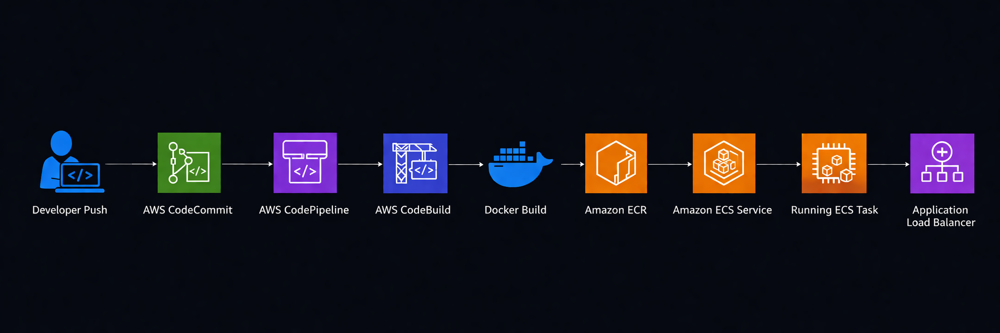
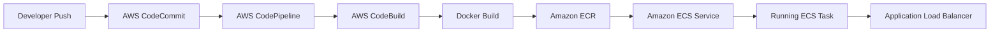
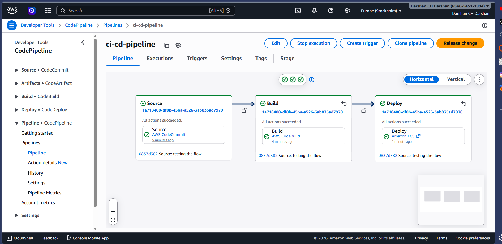
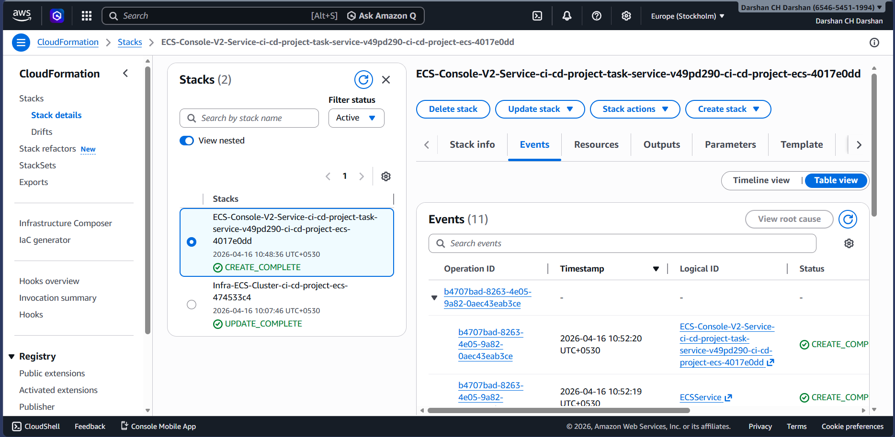
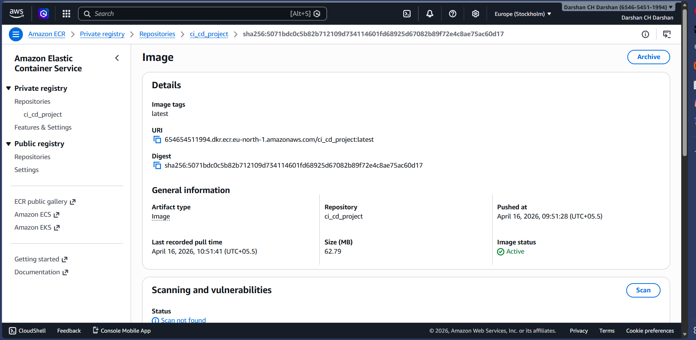
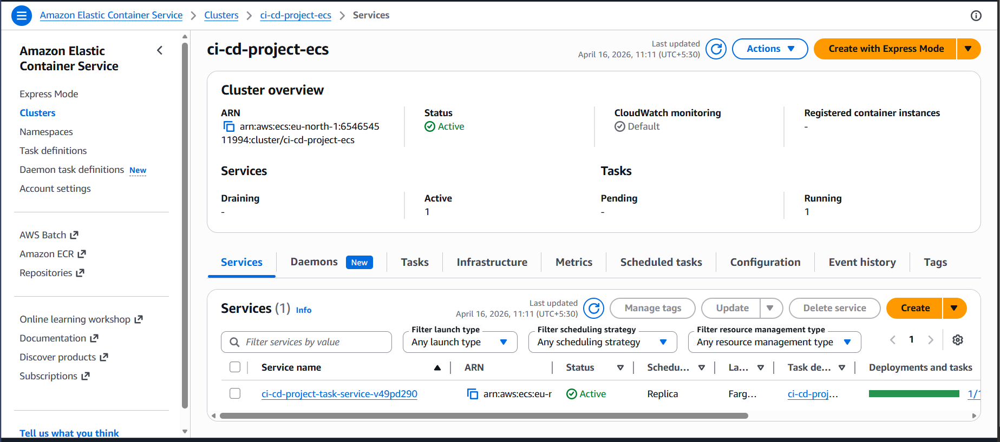
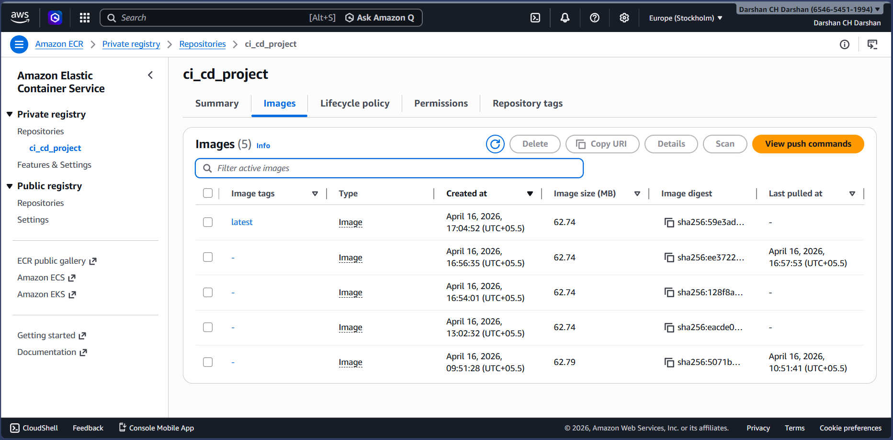
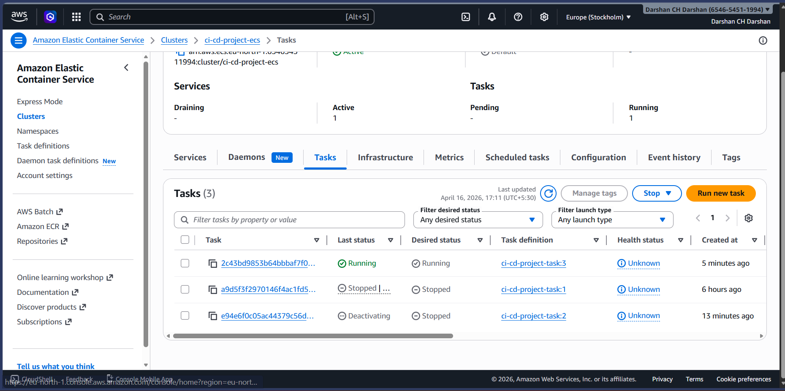
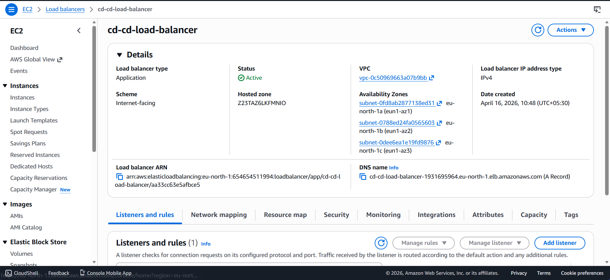
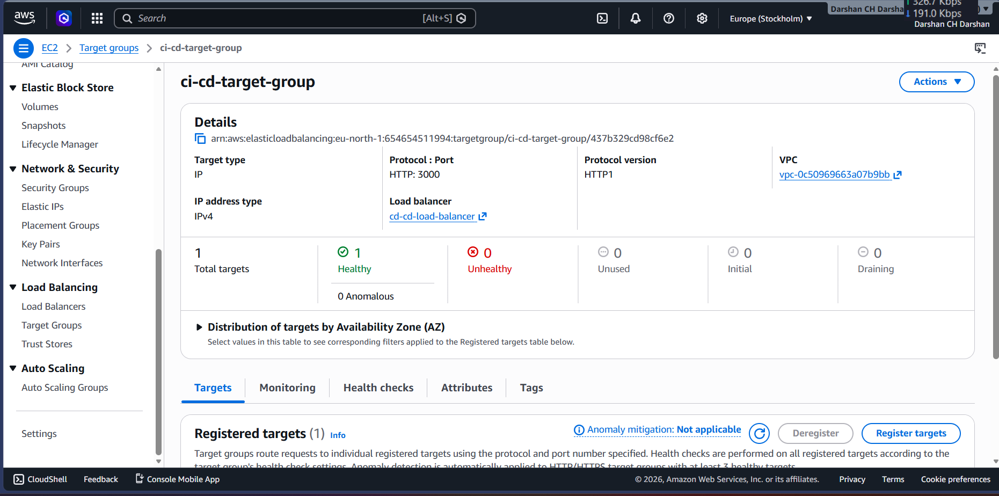

# Node.js CI/CD Pipeline on AWS ECS

This project demonstrates a complete container-based delivery workflow for a Node.js application on AWS. The application is packaged with Docker, pushed to Amazon ECR, and deployed to Amazon ECS through an automated AWS CodePipeline flow.

The repository contains the application code, container definition, and build instructions. The `screenshots/` folder captures the pipeline and AWS resources you created, and this README uses those images to document the end-to-end setup clearly.

## Project Overview

The application itself is a lightweight Express server that:

- serves a landing page from `html/index.html`
- exposes a health endpoint at `/health`
- listens on port `3000`

The delivery pipeline automates the following flow:

1. Source code is stored in AWS CodeCommit.
2. AWS CodePipeline detects a change and starts the pipeline.
3. AWS CodeBuild builds the Docker image.
4. The built image is pushed to Amazon ECR.
5. Amazon ECS pulls the new image and rolls out the updated task.

## Tech Stack

- Node.js
- Express.js
- Docker
- AWS CodeCommit
- AWS CodePipeline
- AWS CodeBuild
- Amazon ECR
- Amazon ECS
- Application Load Balancer
- Target Group
- CloudFormation

## Repository Structure

```text
.
|-- app.js
|-- buildspec.yml
|-- Dockerfile
|-- diagrams/
|   `-- diagram.png
|-- package.json
|-- html/
|   `-- index.html
`-- screenshots/
    |-- ci-cd-pipeline.png
    |-- cloud-formation.png
    |-- ecs-cluster.png
    |-- ecs-new-image-created.png
    |-- elastic-container-registry.png
    |-- load-balancer.png
    |-- target-group.png
    `-- tasks-ecs.png
```

## Application Details

### `app.js`

The app is intentionally simple so the focus stays on the CI/CD pipeline:

- `GET /` returns the frontend page from `html/index.html`
- `GET /health` returns HTTP `200`
- request logs include the hardcoded application version (`1.0.0`)

This makes it a good demo service for container deployment and ECS health validation.

### `Dockerfile`

The Docker image:

- uses `node:alpine` as the base image
- sets a working directory inside the container
- installs dependencies from `package.json`
- copies the project files
- exposes port `3000`
- starts the application with `node app.js`

### `buildspec.yml`

The CodeBuild pipeline performs these steps:

- authenticates Docker with Amazon ECR
- constructs the ECR repository URI from environment variables
- builds the Docker image
- pushes the tagged image to ECR
- generates `imagedefinitions.json` for the ECS deploy stage

The deployment depends on these environment variables being configured in CodeBuild:

- `AWS_ACCOUNT_ID`
- `AWS_DEFAULT_REGION`
- `IMAGE_REPO_NAME`
- `IMAGE_TAG`
- `CONTAINER_NAME`

## CI/CD Workflow

### Architecture Diagram

The following diagram gives a visual overview of the AWS services involved in this project and how the deployment path is connected end to end.

<p align="center">
  
</p>



## How to Run Locally

### Install dependencies

```bash
npm install
```

### Start the app

```bash
node app.js
```

Open:

- `http://localhost:3000`
- `http://localhost:3000/health`

## Run with Docker

### Build the image

```bash
docker build -t nodejs-ssl-server .
```

### Start the container

```bash
docker run -p 3000:3000 nodejs-ssl-server
```

## AWS Deployment Walkthrough

This section documents the infrastructure visible in your screenshots and explains how each AWS service fits into the deployment path.

### 1. CI/CD Pipeline

The pipeline is organized into three main stages:

- `Source` from AWS CodeCommit
- `Build` with AWS CodeBuild
- `Deploy` to Amazon ECS

<p align="center">
  
</p>

### 2. CloudFormation Stack

CloudFormation appears to have been used to provision or manage parts of the infrastructure. Even though the stack template is not stored in this repository, the screenshot shows it as part of the overall delivery setup.

<p align="center">
  
</p>

### 3. Amazon ECR Repository

Amazon ECR stores the Docker images built by CodeBuild. Each successful pipeline execution pushes a fresh image version that ECS can later deploy.

<p align="center">
  
</p>

### 4. ECS Cluster

The ECS cluster is the compute environment where the service runs. This is the target runtime for the application after the pipeline finishes building and publishing the image.

<p align="center">
  
</p>

### 5. ECS Task Revisions and Running Tasks

These screenshots show the rollout behavior after deployment:

- a new task definition or image revision is created
- ECS launches a new task using the updated image
- the running task becomes the active workload

<table>
  <tr>
    <td width="50%">
      
    </td>
    <td width="50%">
      
    </td>
  </tr>
  <tr>
    <td align="center"><sub>New image revision created for deployment</sub></td>
    <td align="center"><sub>Running ECS task after rollout</sub></td>
  </tr>
</table>

### 6. Load Balancer and Target Group

The Application Load Balancer exposes the ECS service and forwards traffic to the target group. The target group is responsible for routing requests to healthy ECS tasks.

<table>
  <tr>
    <td width="50%">
      
    </td>
    <td width="50%">
      
    </td>
  </tr>
  <tr>
    <td align="center"><sub>Application Load Balancer</sub></td>
    <td align="center"><sub>Target Group routing traffic to ECS</sub></td>
  </tr>
</table>

## Deployment Sequence Explained

When you push a change, the pipeline works like this:

1. CodePipeline pulls the latest revision from CodeCommit.
2. CodeBuild reads `buildspec.yml` and logs in to Amazon ECR.
3. Docker builds the application image from the `Dockerfile`.
4. CodeBuild pushes the image to ECR with the configured tag.
5. The ECS deploy stage updates the ECS service to use the new image.
6. ECS starts a new task using the new image and the load balancer shifts traffic to the healthy task.

.
